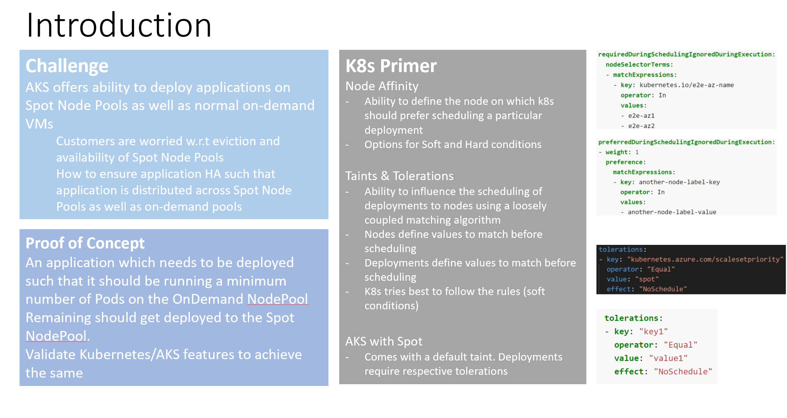
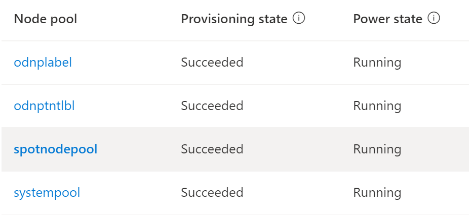
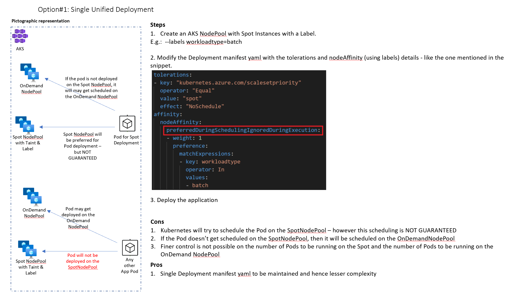
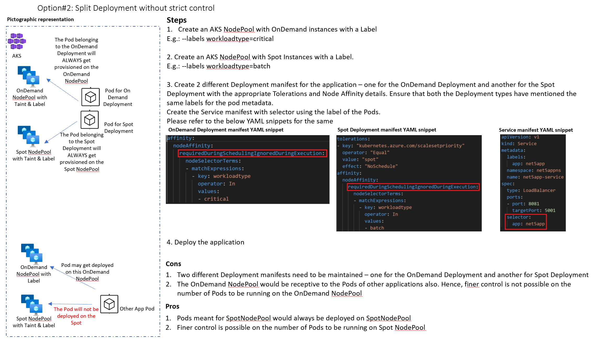
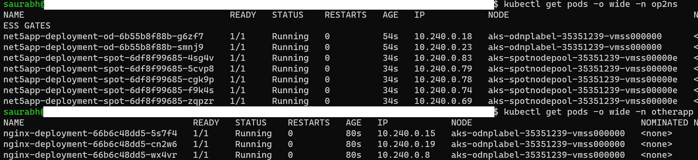
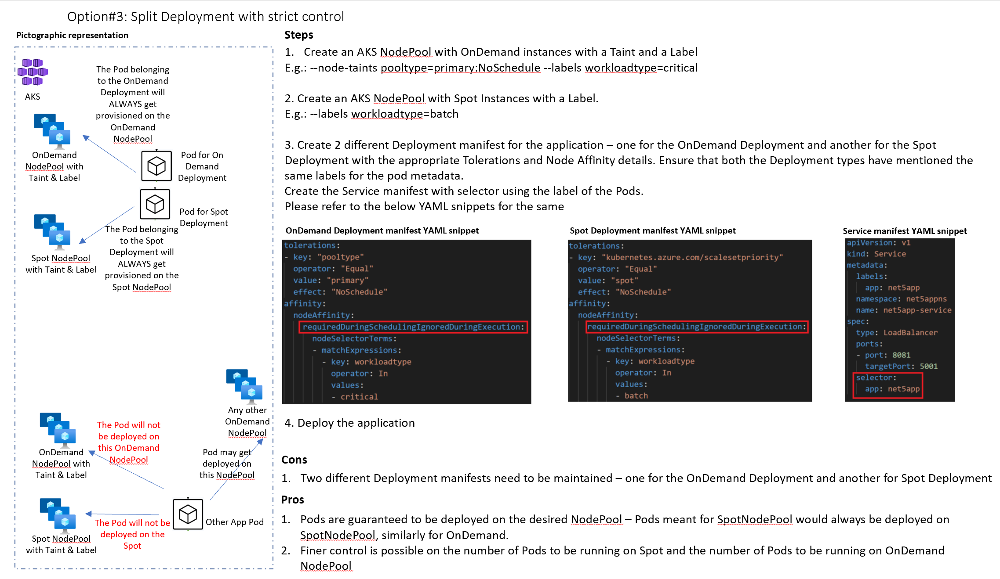
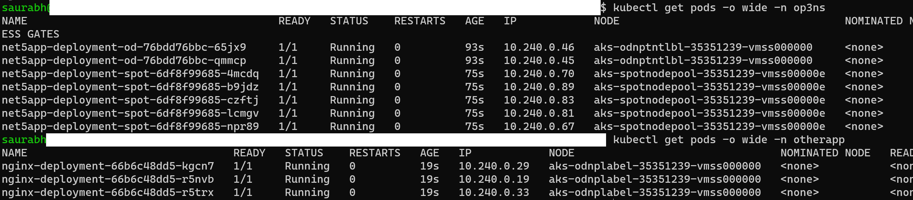

# Cloud Native Application Deployment Patterns in AKS using Spot Nodes

## Introduction:
  

<b>For this prototype, 4 different AKS NodePools were created:</b>   

a. <b>systempool:</b> System NodePool with Taint <b>CriticalAddonsOnly=true:NoSchedule</b> 
b. <b>odnplabel:</b> OnDemand NodePool with Label <b>workloadtype=critical</b> 
c. <b>odnptaintlabel:</b> OnDemand NodePool with Label <b>workloadtype=critical</b> and Taint <b>pooltype=primary:NoSchedule</b> 
d. <b>spotnodepool:</b> Spot NodePool with Label <b>workloadtype=batch</b>. Spot NodePools have built-in Taint <b>kubernetes.azure.com/scalesetpriority=spot:NoSchedule</b>  

<b>Below were the commands that were used to create these AKS NodePools:</b>   
az aks nodepool add --resource-group kedapoc-rg --cluster-name kedapocaks --name systempool --node-count 1 --node-taints CriticalAddonsOnly=true:NoSchedule --mode System  

az aks nodepool add --resource-group kedapoc-rg --cluster-name kedapocaks --name odnplabel --node-count 1 --labels workloadtype=critical  

az aks nodepool add --resource-group kedapoc-rg --cluster-name kedapocaks --name odnptaintlabel --node-count 1 --labels workloadtype=critical --node-taints pooltype=primary:NoSchedule  

az aks nodepool add --resource-group kedapoc-rg --cluster-name kedapocaks --name spotnodepool --priority Spot --eviction-policy Delete --spot-max-price -1 --enable-cluster-autoscaler --min-count 1 --max-count 2 --labels workloadtype=batch  

Below is how the NodePool are looking on the Azure Portal   
   

Now there are 3 different options of patterns in which the application pods can be distributed across the OnDemand and Spot NodePools. The same are as documented below:

## Option 1:  
In this option we will make use of the below files:   
<b>op1net5appdeploy.yaml</b> - This has the application deployment manifest for the net5app which needs to be deployed on the OnDemand and Spot Nodes. This uses the namespace <b>op1ns</b>. 
<b>op1net5appsvc.yaml</b> - This has the service manifest for the above net5app application. This uses the namespace <b>op1ns</b>. 
<b>nginx.yaml</b> - Any other application to be deployed on any available OnDemand NodePool. This uses the namespace <b>otherapp</b>. 

   

As explained in the above diagram, the pods of the application <b>net5app</b> get distributed across the OnDemand NodePool (in my case - <b>odnplabel</b>) and the Spot NodePool (in my case - <b>spotnodepool</b>). However, there is no control as to how many pods may get deployed to OnDemand and how many on Spot. The pods dont get deployed on the OnDemand NodePool <b>odnptaintlabel</b> as this NodePool has a taint <b>pooltype=primary:NoSchedule</b> which is not tolerated by the application defined in op1net5appdeploy.yaml.   

Below is the output that I get when I do a <b>kubectl apply -f</b> on the files <b>op1net5appdeploy.yaml</b>, <b>op1net5appsvc.yaml</b> and <b>nginx.yaml</b>. For the net5app application, results may differ in your case. Please create namespaces <b>op1ns</b> and <otherapp> for trying out option 1. 
   

## Option 2:  
In this option we will make use of the below files:   
<b>op2net5appsplitoddeploy.yaml</b> - This has the application deployment manifest for net5app which needs to be deployed on the OnDemand NodePool. This uses the namespace <b>op2ns</b>. 
<b>op2net5appsplitspotdeploy.yaml</b> - This has the application deployment manifest for net5app which needs to be deployed on the Spot NodePool. This uses the namespace <b>op2ns</b>. 
<b>op2net5appsvc.yaml</b> - This has the service manifest for the above net5app application. This uses the namespace <b>op2ns</b>. 
<b>nginx.yaml</b> - Any other application to be deployed on any available OnDemand NodePool. This uses the namespace <b>otherapp</b>. 
  
    

As explained in the above diagram, the pods of the application <b>net5app</b> get distributed across the OnDemand NodePool (in my case - <b>odnplabel</b>) and the Spot NodePool (in my case - <b>spotnodepool</b>). Here, we are able to apply the control over how many pods can get deployed to the OnDemand (in my case - 2) and how many on the Spot NodePool (in my case - 5). The pods dont get deployed on the OnDemand NodePool <b>odnptaintlabel</b> as this NodePool has a taint <b>pooltype=primary:NoSchedule</b> which is not tolerated by the application defined in op2net5appsplitoddeploy.yaml.   

Below is the output that I get when I do a <b>kubectl apply -f</b> on the files <b>op2net5appsplitoddeploy.yaml</b>, <b>op2net5appsplitspotdeploy.yaml</b>, <b>op2net5appsvc.yaml</b> and <b>nginx.yaml</b>. Please create namespaces <b>op2ns</b> and <otherapp> for trying out option 1. 
   

If we observe carefully, we do have control as to how many pods can get deployed on the OnDemand and Spot NodePools. However, we also see that the <b>nginx</b> pods from the <b>otherapp</b> namespace also get deployed on the same OnDemand NodePool <b>odnplabel</b>. If you have a requirement that you want your OnDemand NodePool to be restricted only for a desired application and no other application should share the same OnDemandNodePool, then please refer the third option.   

## Option 3:  
In this option we will make use of the below files:   
<b>op3net5appsplitoddeploy.yaml</b> - This has the application deployment manifest for net5app which needs to be deployed on the OnDemand NodePool. This uses the namespace <b>op3ns</b>. 
<b>op3net5appsplitspotdeploy.yaml</b> - This has the application deployment manifest for net5app which needs to be deployed on the Spot NodePool. This uses the namespace <b>op3ns</b>. 
<b>op3net5appsvc.yaml</b> - This has the service manifest for the above net5app application. This uses the namespace <b>op3ns</b>. 
<b>nginx.yaml</b> - Any other application to be deployed on any available OnDemand NodePool. This uses the namespace <b>otherapp</b>. 
  
   

As explained in the above diagram, the pods of the application <b>net5app</b> get distributed across the OnDemand NodePool (in my case - <b>odnptaintlabel</b>) and the Spot NodePool (in my case - <b>spotnodepool</b>). Here, we are able to apply the control over how many pods can get deployed to the OnDemand (in my case - 2) and how many on the Spot NodePool (in my case - 5). The pods dont get deployed on the OnDemand NodePool <b>odnplabel</b> as this NodePool doesnt have a the required taint <b>pooltype=primary:NoSchedule</b> which is tolerated by the application defined in op3net5appsplitoddeploy.yaml.   

Below is the output that I get when I do a <b>kubectl apply -f</b> on the files <b>op3net5appsplitoddeploy.yaml</b>, <b>op3net5appsplitspotdeploy.yaml</b>, <b>op3net5appsvc.yaml</b> and <b>nginx.yaml</b>. Please create namespaces <b>op3ns</b> and <otherapp> for trying out option 3. 
   

If we observe carefully, we do have control as to how many pods can get deployed on the OnDemand and Spot NodePools. We also see that the <b>nginx</b> pods from the <b>otherapp</b> namespace do not get deployed on the same OnDemand NodePool <b>odnptaintlabel</b> the same OnDemand NodePool, but they get deployed on another OnDemand NodePool <b>odnplabel</b>. This way we have satisfied the requirement OnDemand NodePool should be restricted only for a desired application and no other application should share the same OnDemandNodePool.   

## Co-author information:
<b>Yusuf Rangwala (Global Black Belt - Cloud Native @ Microsoft)</b> worked with me on the prototype and the content used for this article.   His GitHub id is: https://github.com/whereisyusuf

## Disclaimer
Views are personal
